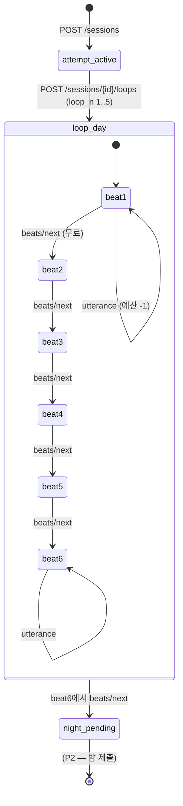

# P1 설계서 — 하루 (Day) · 방어선 ①

> 범위: 작업지시서 §P1. 명세: 기획서 v8.1 §4.1, §5.1~5.4, §8.2 Planner/Agent, §8.6 시스템 하네스, §4.10 손상, 부록 A.3~A.4
> 상태: **승인 대기.** 승인 전 코드 없음
> P0와 동일하게 이 문서에 시나리오 고유 명사를 쓰지 않는다

---

## 0. 범위 / 비범위

**만드는 것** — 세션·판·회차 상태 머신, 발화 예산, Planner/Agent 유스케이스, 시스템 하네스 파이프라인, 의심·신뢰 도메인 함수, `ask_npc`, 7세 정책 프롬프트, 노트(파편), API 5개.

**만들지 않는 것** — 밤 파이프라인(Normalizer/Evaluator/채점: P2), 신의개입(P3), Manager·원숭이손(P4), 쿠키·재도전(P5), ollama/gemini 실어댑터(스위치만, P6에서 확정). 비트 6 종료 시 회차는 `night_pending` 상태에서 멈춘다 — 밤 API는 P2가 연다.

---

## 1. 상태 머신 (도메인 순수 함수)



- 전이 함수는 전부 순수 함수: `(LoopState, Action) → LoopState | DomainError`. LLM·DB import 0
- **발화 예산**: 회차 시작 시 `budget = 9 - loop_n` (1회차 8 → 5회차 4). 발화만 차감, 비트 넘기기 무료
- **탐문 예산**: `ask_budget = 2` 회차당 (NPC의 `ask_npc` 호출)
- **손상**: `loop_n → (damage_level, morning_shifted)` 순수 함수 — 1회차 (0, F), 2회차 (1, F), 3회차 (2, F), 4회차 (2, **T** ← 아침 문장 변형), 5회차 (3, F). 문장 텍스트는 ScenarioPort가 제공, 엔진은 정수·플래그만
- 회차는 1..5 순서 강제. 6회차 시작 시도·닫힌 attempt에 대한 행동은 도메인 에러
- 잘못된 전이는 HTTP 409로 매핑

## 2. 의심·신뢰 — 계산은 코드, 판단은 LLM

원칙 3과 Agent 출력 스키마(지시서의 `suspicion_delta`)의 긴장을 이렇게 푼다: **LLM은 단계를 고르고, 단계의 수치 의미는 도메인 상수다.** ★결정 1★

| 항목 | 값 | 근거 |
|---|---|---|
| 의심도 범위 | 0..100, 임계 **60** | 지시서 §P1 |
| Agent가 고르는 의심 단계 | `0 \| 4 \| 12` (무관·경미·결정적) | 기획서 8.9 관찰 예시의 +4/+12 |
| 신뢰 단계 | `0 \| 6` — **비용 행동 판정 시에만 6** | 5.4 "말로는 안 쌓인다" |
| 도구 불일치 발각 | 발화자 +12, 빌린 출처 NPC +6 | 8.5·8.9 |
| 임계 돌파 | `opposite_mode = true` — 이후 그 NPC는 유저 말과 반대로 행동 (프롬프트에 반영) | 5.4 |
| 회차 리셋 | 의심 0으로, 신뢰 `round(trust × 0.05)` **5% 잔류**, 기억 소거 | 6.1 |

누적·clamp·임계 판정·잔류 계산 전부 `domain/` 순수 함수. Agent의 단계 선택이 스키마 검증(Literal)을 통과하지 못하면 하네스가 재생성시킨다.

## 3. Planner / Agent 유스케이스

**Planner** — 회차 시작 시 1회. 입력: NPC별 목표(persona)·초기 상태·누적 규칙(P1은 빈 목록 자리만). 출력 스키마:

```json
{ "plans": [ { "npc": "<code>", "beats": [ { "beat": 1, "action": "<행동 어휘>" }, ... ] } ] }
```

행동 어휘는 ScenarioPort가 제공(부록 B의 action과 같은 축). 계획은 `npc_states.plan`(JSONB)에 저장.

**Agent** — 유저 발화마다 대상 NPC 1회 판단. 입력 = Planner 방침 + NPC 상태(의심·신뢰·opposite_mode) + 최근 **3턴** 대화창(그 이전은 주지 않는다 — 망각의 구현) + 유저 발화 + 적용 규칙(빈 자리). 출력 스키마 (지시서 그대로):

```json
{ "reply": "...", "suspicion_delta": 0|4|12, "trust_delta": 0|6,
  "tool_call": { "name": "ask_npc", "args": { "target": "<code>", "topic": "..." } } | null,
  "plan_change": "<변경 요지>" | null }
```

**프롬프트 조립 순서** (use_case 층 프롬프트 빌더): ① 7세 정책(엔진 상수 — §5) ② persona·대사 톤(ScenarioPort) ③ 계획·상태 ④ 3턴 창 ⑤ 발화. Advisor류와 달리 Agent 프롬프트에는 스토리보드가 들어가지 않는다 — persona와 목표만.

**`ask_npc` 흐름**: Agent가 tool_call 반환 → 탐문 예산 확인(소진 시 무시하고 기록만) → 대상 NPC에게 사실 확인(Fake/LLM 1회) → 결과를 발화 NPC 응답에 반영 → **부작용**: 대상 의심도 +, 불일치면 발화자 +12 → `tool_call` 이벤트 기록.

## 4. 시스템 하네스 파이프라인 (§8.6)

```
LLM 출력 → [1] JSON 스키마 검증 → [2] 발화 금칙어 검출 → [3] 소실 인물 언급 검출
   실패 시 ─→ 거부 + 재생성 (최대 2회) ─→ 그래도 실패 → 폴백 대사 (ScenarioPort 제공)
```

- **잡는 것**: 스키마 위반, 세계 사실 누설(금칙어), 소실 인물 언급. **안 잡는 것**: 느림·오해·망각 (판단 층 불가침)
- `SYSTEM_HARNESS=off` → [2][3]만 끈다. **[1] 스키마 검증은 항상 켠다** — ablation 대상은 사실 층이지 시스템 안정성이 아니다 ★결정 2★
- 거부·재생성·폴백 각 단계는 이벤트로 기록해 P6 누설률 계측의 원천이 된다 (utterance 이벤트의 `disclosure_level` + 별도 하네스 카운터는 payload 내 기록)
- **발화 금칙어 ≠ P0 코어 금칙어.** P0의 `forbidden_words()`는 소스 코드 CI용. NPC 발화 금칙(부록 A.4)은 예외 조건이 있다(특정 NPC는 특정 회차부터 허용). ScenarioPort 확장 ★결정 3★:

```
utterance_bans() -> list[{word, exempt_code: str|null, from_loop: int|null}]
fallback_line(npc_code) -> str
```

## 5. 7세 정책 프롬프트 (엔진 상수)

지시서 명시대로 ScenarioPort가 아니라 **engine에** 둔다 (`app/use_cases/` 프롬프트 빌더의 상수). 내용 네 줄 — "직접 질문에는 사실대로 답한다 / '왜?'에는 모른다 / 3턴 이전 일은 모른다, 물으면 '그랬어?' / 지시·규칙은 문자 그대로 실행한다". 시나리오 무관 — 어휘·톤은 시나리오 persona가 얹는다.

## 6. 데이터 — 신규 테이블 4 + 시드 1

| 테이블 | 필드 요지 | 프랙탈 |
|---|---|---|
| `attempts` | id(uuid), attempt_n, prior_attempt_id?, status(active\|closed) | session_router와 1:1 |
| `loops` | id, attempt_id FK, loop_n(1..5), beat(1..6), budget_left, ask_budget_left, state(day\|night_pending), damage_level | loop_router와 1:1 |
| `npc_states` | id, loop_id FK, code, suspicion, trust, opposite_mode, memory(JSONB, 최근 3턴), plan(JSONB) | **라우터 없음** — 내부 상태 (프랙탈 예외, devlog 기록) |
| `notes` | id, attempt_id FK, kind(fragment\|confirmed\|rule_observation), text, loop_n, source_key(중복 방지 자연키) | note_router(GET)와 1:1 |
| `scenario_fragments` (시드) | scenario, loop_n, text — 부록 A.3 회차별 파편 | 시드 테이블 (P0 방식 upsert) |

- 게임 상태는 **명시적 상태 테이블**로 둔다. 이벤트 소싱이 아니다 — `events`는 부록 C 목적의 append 로그로 유지, 상태 복원에 쓰지 않는다 ★결정 4★
- 회차 시작 시: 이전 회차 npc_states에서 신뢰 5% 잔류 승계 + 해당 회차 파편을 notes에 적립(source_key로 중복 방지 — upsert, early-return 아님)
- ScenarioPort 확장분: `utterance_bans()`, `fallback_line()`, `fragments()`(회차별), `entry_lines()`(진입 3줄), `morning_lines()`(평상·변형 2종), `action_vocabulary()`(Planner 행동 어휘). scenario_a·example 두 어댑터 모두 갱신 + 계약 테스트 확장

## 7. API (지시서 §P1 그대로)

| 엔드포인트 | 응답 요지 |
|---|---|
| `POST /sessions` | attempt_id, entry_lines(3줄) — `session_start` 기록 |
| `POST /sessions/{id}/loops` | loop_id, loop_n, morning_text, damage_level, budget — Planner 실행, `loop_start` 기록 |
| `POST /loops/{id}/utterances` `{target, text}` | reply, 남은 예산, beat, (tool 사용 여부는 이벤트로만) — `utterance`(+`tool_call`) 기록 |
| `POST /loops/{id}/beats/next` | beat, narration(ScenarioPort), day_done 여부. 원숭이손 오퍼 자리는 null 고정(P4) |
| `GET /loops/{id}/notes` | 파편·확인 사실·규칙 3분류 목록 (P1은 파편만 채워짐) |

이벤트 필드 중 P1에서 아직 산출 불가한 것(예: `disclosure_level` 정교화)은 0/기본값으로 기록하고 P6 계측 때 재검토 — 필드는 빼지 않는다.

## 8. 테스트 목록

**도메인 (LLM 없이)**
1. 회차별 예산 8→4, 소진 시 발화 거부, 비트 넘기기 무료
2. 비트 1..6 순서, 6에서 next → night_pending, 이후 발화 거부
3. 의심 누적·clamp·임계 60 돌파 → opposite_mode, 잔류(의심 0·신뢰 5%)
4. 신뢰: trust_delta 6은 비용 행동 판정에서만 수용
5. 손상 함수: 회차 → (damage_level, morning_shifted) 5케이스
6. 탐문 예산 2 초과 시 도구 미실행

**유스케이스 (FakeLLM)**
7. Planner: 스키마 통과 계획이 npc_states에 저장
8. Agent: 3턴 창 — 4턴 전 발화가 프롬프트에 없음 / opposite_mode가 프롬프트에 반영
9. 하네스 ON: 금칙어 심은 FakeLLM 큐 → 재생성 → 폴백, 최종 응답 금칙어 0 (**ablation ①**)
10. 하네스 OFF: 같은 큐에서 누설 재현 (**ablation ②**)
11. 소실 인물 언급 → 거부·재생성 / 스키마 위반 → 재시도 2회 후 폴백
12. `ask_npc` 불일치 → 발화자 +12·대상 + (완료 조건)
13. 예외 조건 금칙어: 허용 NPC·회차에서는 통과

**E2E (완료 조건)**
14. fake로 한 회차 6비트 완주: sessions → loops → 발화 → beats ×6 → night_pending. `session_start`·`loop_start`·`utterance`·`tool_call` 이벤트 적립 검증

## 9. 완료 조건 (지시서 §P1 그대로)

- [ ] fake로 한 회차 6비트 완주 E2E — devlog에 이벤트 적립 수 기록
- [ ] 하네스 ON 금칙어 발화 0건 / OFF 누설 재현 (ablation 2건)
- [ ] 의심 임계 돌파 시 반대 행동 테스트
- [ ] `ask_npc` 불일치 발각 → 대상 의심도 상승 테스트

## 10. 승인 시 함께 결정해 달라

1. **의심·신뢰 단계값**: Agent 출력을 `0|4|12` / `0|6` Literal로 제한 (LLM은 단계 선택, 수치는 도메인 상수) — 원칙 3 절충안
2. **ablation 범위**: `SYSTEM_HARNESS=off`가 금칙어·소실 인물 검출만 끄고 스키마 검증은 유지
3. **ScenarioPort 확장 6종** (utterance_bans·fallback_line·fragments·entry_lines·morning_lines·action_vocabulary) — 시나리오 어댑터 2종 갱신 포함
4. **상태 테이블 방식** (이벤트 소싱 아님) + `npc_states` 라우터 없는 내부 테이블 (프랙탈 예외)
