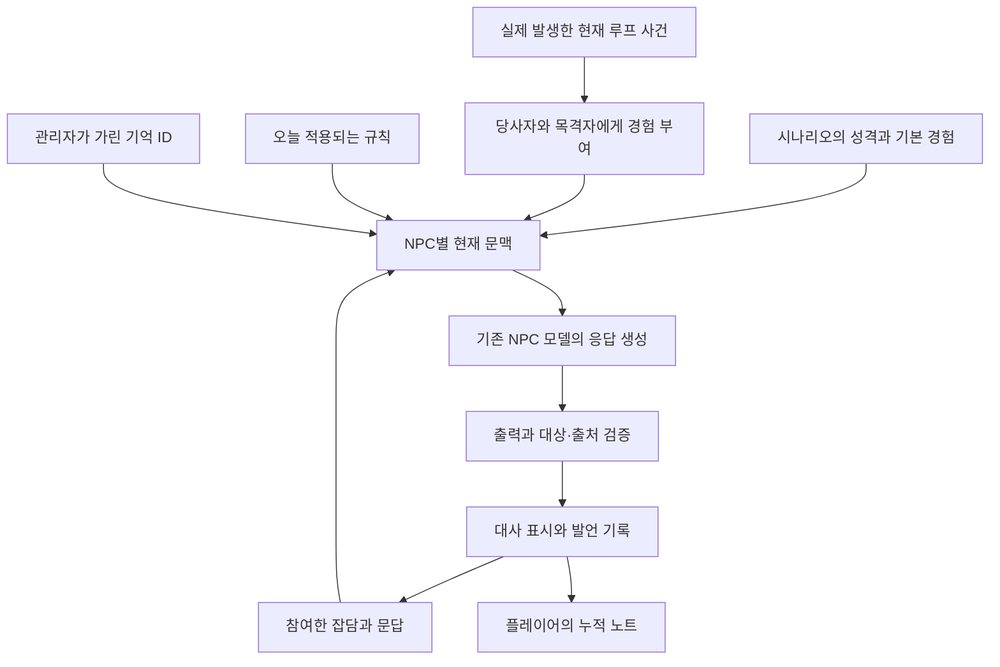

# NPC 대화·페르소나·루프 기억 개선 — 최종 권고안

날짜: 2026-09-15

**추가 결정:** 사용자 요청으로 장면당 캐릭터 1회 제한을 복구한다. 대사·페르소나·당일 기억 개선, 하루 예산, 요청 재전송의 중복 차감 방지는 유지한다. 아래 모델 비교·과거 검증 기록의 연속 문답은 당시 조건이며 현재 플레이 규칙과 구분한다.

상태: **사용자 승인 후 대화·페르소나·기억·후속 질문 구조 구현, 백엔드 460개 및 헤드리스 UI 4종 검증 완료. 실모델의 의미 품질과 실제 플레이 밸런스는 별도 판단한다.** [검증 기록](../../review-verification/2026-09-15-npc-dialogue/README.md), [모델 평가](../../model_evaluation.md).

## 1. 결론

**NPC는 자기 경험과 감정을 쉬운 말로 이야기한다. 플레이어는 여러 인물의 증언과 반복되는 하루의 차이를 연결해 멸망의 원인을 알아낸다.**

권고하는 구현은 **시나리오가 사건·인물별 지식·성격을 정의하고, 엔진이 현재 상태와 기억을 관리하며, 기존 NPC 모델이 그 범위에서 대사를 만드는 방식**이다.

핵심 결정은 다섯 가지다.

1. **7세 느낌:** 쉬운 표현과 생활 중심의 관심사를 지향한다. 질문 이해, 자기 행동의 이유 설명, 당일 기억은 보장한다.
2. **페르소나:** 성격·욕구·두려움·기본 관계는 루프마다 유지한다. 오늘의 감정·대화·친밀감은 그날 경험에 따라 변한다.
3. **루프:** NPC의 당일 기억은 다음 루프에서 초기화한다. 플레이어의 노트와 적용한 규칙은 한 판 안에서 누적한다.
4. **탐문:** 질문에 답한 뒤 필요한 만큼 설명한다. 장면당 캐릭터 1회 제한을 유지하고, 후속 질문은 다음 장면에서 기존 대화 예산을 소비한다.
5. **평가:** 질문 관련성, 사실과 관점의 일관성, 기억 경계, 캐릭터 구별, 추리 진행을 평가한다.

‘최적’은 현재 코드의 재사용, 대화 품질, 추리의 공정성, 응답 지연을 함께 고려한 권고다. 최종 체감과 난이도는 같은 모델의 비교 평가와 실제 플레이로 확인한다.

## 2. 사용자 의도와 확인된 프로젝트 상태

### 사용자 의도

- 이면은 돼지농장에서 질병과 죽음을 겪은 존재들의 이야기다. 대화를 통해 멸망의 사유를 이해하는 것이 중심 경험이다.
- ‘7세’는 적당히 단순하고 순수한 느낌을 설명한 예시다. 무지·비문·무조건적인 회피를 원하는 것이 아니다.
- 루프가 돌아갈 때 기억이 사라지는 기존 구조를 고려한다.
- 캐릭터마다 페르소나가 드러나야 한다.

본안은 기존 게임처럼 NPC가 반복을 자각하지 않고 해당 하루를 현재로 경험하는 구조를 기준으로 한다. 사후세계의 구체적인 규칙이나 NPC의 죽음 인지 여부는 이 개선에서 새로 확정하지 않는다.

### 조사 결과 — 수정 전 상태

| 확인한 사실 | 의미 |
|---|---|
| 최근 판 `0468b70c-589d-4608-8a25-b7dc6063755a`의 직접 답변 8개 모두에 ‘몰라’가 포함됨. NPC 호출 폴백 0건 | 정상 생성된 대사의 품질 문제다. 단어 포함만으로 개별 답변의 실패를 판정하지는 않는다 |
| 은상이 자기 행동을 묻는 질문에 ‘은상이 … 속닥였어. 뭐라고 했는지는 몰라’라고 답함 | 주체와 관점이 무너졌으며 기존 검사에서 통과했다 |
| ‘규정이야. 방송에서 말했어’를 없는 사람 이름 ‘규정’으로 오인해 거부함 | 검사 오탐이 답변을 더 나쁘게 바꾼 실제 사례다 |
| NPC 기억은 저장 단계에서 최근 3줄만 남음 | 장면 잡담 3줄이 이전 문답을 모두 밀어낼 수 있다 |
| 민석의 루프 인지자 역할은 v6의 설정. v8.1 문서에서 관리자로 이전했다고 명시 | 민석만 이전 루프를 기억하는 예외는 현재 구현에 없다 |
| 현재 새 루프는 네 NPC 모두 `memory=[]`, 의심 0, 반대 행동 해제, 신뢰 `round(이전 신뢰 × 0.05)`로 시작 | 신뢰 수치 잔류는 대화 내용의 기억과 다르다 |
| 관리자는 이전 회차 점수·누적 규칙 등을 입력받음 | 기획상의 루프 인지 역할과, 모든 과거 대화를 보존하는 구현은 구분해야 한다 |
| 장면 잡담은 작성된 대사이고 직접 답변은 모델이 생성 | 둘이 같은 사건·인물 지식에 근거해야 연결된다 |
| 같은 장면에서 같은 NPC에게 1회만 질문 가능 | 답변을 듣고 바로 이유나 출처를 묻는 탐문이 막힌다 |
| 발언 관찰의 키는 현재 `utterance-{beat}-{npc_code}` | 후속 질문 허용 시 질문별 고유 ID로 변경해야 두 번째 답변이 첫 답변의 관찰로 합쳐지지 않는다 |
| 기존 7세 평가는 딴소리·3턴 망각·무조건적인 전언 수용을 통과로 인정 | 새 목표에 맞춰 평가 기준과 모델 선정 근거를 갱신해야 한다 |

근거:

- [현재 루프 초기화와 대화 경로](../../../backend/apps/engine/app/use_cases/loop_interactor.py)
- [기억·신뢰 도메인 규칙](../../../backend/apps/engine/domain/entities/npc_rules.py)
- [현재 프롬프트](../../../backend/apps/engine/app/use_cases/prompts.py)
- [현재 시나리오](../../../backend/apps/scenarios/scenario_a/adapter.py)
- [민석 역할 이전을 기록한 v8.1 기획서](../../REMAKE_DAY_기획서_v8.1.md)
- [v9.0 기획서 §11.4](../../define/REMAKE_DAY_기획서_확정본_v9.0_2026-09-10.md)
- [기존 7세 평가](../../../backend/scripts/run_age7_check.py)

## 3. 대안 비교

| 대안 | 장점 | 부담·한계 | 판단 |
|---|---|---|---|
| **사건·지식·기억을 엔진에서 관리하고 모델이 표현** | 자유 질문, 인물 차이, 루프 일관성을 함께 다룬다. 기존 사건·대사 데이터를 재사용한다 | 지식의 소유자와 출처, 기억 경계의 명시가 필요하다 | **채택 권고** |
| 프롬프트와 모델만 조정 | 빠르게 시도할 수 있다 | 3줄 기억, 관점 혼합, 후속 질문 차단, 검사 오탐이 남는다 | 비교 기준과 초기 실험에 사용 |
| 모든 질문을 작성된 대사로 처리 | 작성한 범위의 내용과 말투를 강하게 통제한다 | 자유 질문과 후속 질문의 표현을 모두 처리하는 비용이 크다 | 특정 핵심 공개 장면·대체 응답에 제한적으로 사용 |

기존 모델 `kanana1.5:8b-q4km`를 고정한 상태에서 설계 효과를 먼저 측정한다. 모델 교체 여부는 새 기준으로 현재 모델의 한계가 확인된 뒤 판단한다.

## 4. 기억과 루프의 계약

### 4.1 기억의 세 층

| 층 | 내용 | 하루 안 | 새 루프 |
|---|---|---|---|
| 기본 경험과 성격 | 친구 이름, 시작 전 경험, 생활 규정, 욕구, 기본 관계 | 사용 가능 | 시나리오의 시작 상태로 다시 제공 |
| 당일 경험과 문답 | 자신이 한 일, 실제로 본 일, 출처가 있는 전언, 주고받은 말 | 유지. 지정된 관리자 보정은 별도 적용 | 초기화 |
| 플레이어의 누적 기록 | 지난 루프 관찰·노트·가설·답안 | 플레이어가 열람 | 같은 판 안에서 유지 |

- ‘충식이 어제 이송됐다’라는 시작 전 사건은 이전 반복에서 배운 기억과 다르다.
- NPC는 플레이어의 누적 노트에 자동 접근하지 않는다.
- 플레이어가 지난 루프 일을 말해 주면 이번에 들은 전언으로 다룬다. ‘이제 기억났어’라는 자기 경험으로 승격하지 않는다.
- 신뢰 5% 잔류는 현재 계산을 유지한다. 이것만으로 이름·문장·행동을 회상시키지 않는다.
- 루프에 따른 인물 소실과 단서 공개 조건은 기본 지식에도 적용한다. 단순한 기억 초기화로 소실 조건을 우회하지 않는다.

### 4.2 하루 안의 기억

3줄 절단과 ‘세 마디 전에는 반드시 잊는다’는 프롬프트를 제거한다. 현재 게임의 당일 문답은 대화 예산으로 제한돼 있으므로 우선 원문을 유지한다. 별도의 요약 모델이나 장기 기억 검색 서비스는 추가하지 않는다.

NPC가 참여한 잡담과 플레이어 문답에는 화자·청자·시점·발화 ID를 보존한다. 잡담이 새로 들어와도 중요한 자기 경험이 사라지지 않도록 대화 원문과 경험 정보를 구분한다.

### 4.3 관리자의 기억 삭제

관리자에게는 삭제 가능한 **당일 경험·문답의 ID**를 제공하고 그중 하나를 선택하게 한다. 성격이나 이름 전체를 무작위로 지우는 기능으로 확장하지 않는다.

- 원래 사건 로그와 플레이어 노트는 남는다.
- NPC의 해당 기억만 가려지고, 가려진 출처 ID는 문맥을 다시 구성할 때도 제외한다.
- 직접 답변, 잡담 관련 문맥, `ask_npc`, 규칙에 따른 정보 공개가 같은 기억 가림 상태를 적용한다.
- 다시 보고 들은 별도 사건이 발생하면 새 출처로 배울 수 있다. 눈앞의 물리적인 상황을 보지 못하는 것으로 처리하지 않는다.
- 삭제 대상·이유·실제 적용 결과는 로그로 검증한다. 잘못된 ID를 요청하면 적용 성공으로 기록하지 않는다.
- 기존 루프당 보정 예산과 관리자 역할을 기준으로 구현한다. 관리자의 전체 과거 기억 확장은 별도 범위다.

구현 시 수첩의 날짜·이름·남은 쟁반 수는 고정 지식에서 제거하고, 실제로 수첩을 펼쳐 보는 행동의 경험에 연결했다. 오늘의 기록이 삭제된 뒤에도 고정 지식으로 같은 내용을 계속 공급하던 중복을 없애며, 나중에 실제로 다시 본 경우에는 새 출처로 알 수 있다. NPC가 사용하는 짧은 출처 별칭은 저장 전에 영구 ID로 복원한다.

## 5. 7세 느낌의 새 정의

### 허용하고 기대하는 능력

- 질문의 대상과 지시어를 이해하고 이전 대화에 이어서 답한다.
- 자기 행동의 이유와 감정을 설명한다. ‘무서워서’, ‘잊을까 봐’, ‘궁금해서’를 사용할 수 있다.
- 직접 경험한 범위의 간단한 인과를 말한다. ‘그래서’, ‘왜냐면’을 금지하지 않는다.
- 들은 말과 직접 본 것을 구분한다. 자기 경험과 다른 말에는 쉬운 말로 반응할 수 있다.
- 구체적인 부탁을 이해하고, 정해진 규칙의 실제 행동 결과를 이야기한다.

### 지식의 경계

- NPC가 경험하지 않은 다른 사람의 속마음, 질병의 정확한 원리, 시설 전체의 목적, 숨은 정체의 정답은 전달하지 않는다.
- 자기 두려움과 자신의 동기는 말할 수 있다. 다른 인물의 마음은 추측이라면 추측으로 드러낸다.
- 규칙을 문자 그대로 실행하는 것은 게임의 세계 규칙이다. 일상 대화의 이해력까지 낮추는 근거로 사용하지 않는다.

### 공통 응답 지침 초안

> 질문에 먼저 답한다. 쉬운 말과 자연스러운 반말로 보통 한두 문장, 설명이 필요하면 더 말한다.
> 자신이 한 일은 ‘내가’ 한 일로 말한다. 본 것, 들은 것, 믿는 것을 구분한다.
> 아는 이유와 감정은 말한다. 모르는 부분만 모른다고 한다.
> 관련된 경험이 있으면 이어 말할 수 있다. 관련 없는 단서를 억지로 붙이지 않는다.
> 숨기는 것이 있으면 그 두려움이 드러나게 답한다. 다른 질문까지 회피하지 않는다.
> 오늘 나눈 대화를 기억한다. 이전 반복에서 생긴 일을 직접 기억하는 척하지 않는다.
> 제공받지 않은 사건·인물·약속·관찰을 만들어내지 않는다.

각 인물의 예시는 이 지침과 충돌하지 않게 작성한다. ‘몰라. 그냥.’과 화제 전환을 정답 예시로 반복하지 않는다.

공통 말하기 정책은 엔진에서 한 번 적용하고, 시나리오에는 인물별 성격·지식·예시를 둔다. 현재처럼 각 페르소나에 동일한 망각·회피 문구를 덧붙여 지시를 중복하지 않는다. NPC 문맥에 숨은 정답 설명을 넣은 뒤 발화 금지로만 막는 방식도 피한다.

## 6. 캐릭터 페르소나

아래는 기존 역할에 추가할 **제안**이다. 지식 자체의 내용은 시나리오 사실과 대조해 확정한다.

| 인물 | 성격·욕구 | 두려움·갈등 | 말과 관심의 특징 | 편안할 때 / 압박받을 때 |
|---|---|---|---|---|
| 채연 | 정이 많고 괜찮은 척한다. 친구들과 남고 싶다 | 아픈 것이 드러나 이송될까 두렵다. 도움은 필요하지만 받기 어렵다 | 상대의 추위나 불편함을 챙긴다. 자기 몸 이야기는 조심스럽다 | 상대를 챙김 / 짧게 방어하지만 신체감각이나 두려움 일부는 드러냄 |
| 민석 | 성실하고 역할을 잘하고 싶다. 규정을 믿는다 | 이상한 것을 놓치거나 자신이 잘못할까 걱정한다 | 순서·기록·방송 내용을 또박또박 설명한다. 도움이 되면 뿌듯해한다 | 이유를 설명함 / 규정을 되풀이하거나 확인하려 함 |
| 은상 | 붙임성이 있고 반응이 빠르다. 누군가 들어주길 바란다 | 혼자 남거나 자기에게도 같은 일이 생길까 두렵다 | 먼저 말을 건다. 출처가 있는 이야기에 걱정과 해석을 덧붙인다 | 자기 걱정도 털어놓음 / 말을 서두르고 상대에게 안심을 구함 |
| 준 | 친근하고 호기심이 많다. 함께 알아보고 싶다 | 익숙한 사람이 없어지고 이유를 모르는 상황이 꺼림칙하다 | 숫자·물건·작은 차이를 살핀다. 답한 뒤 함께 보자고 한다 | 발견을 나눔 / 모순되는 부분을 자꾸 묻거나 곁에 있으려 함 |

### 기본 관계

- 채연은 민석의 시선을 부담스러워한다. 그 부담을 모든 사람에 대한 경계로 확대하지 않는다.
- 민석은 채연의 변화에 주목하고 방송을 믿는다. 악의를 가진 심문관으로 연기하지 않는다.
- 은상은 다른 사람의 반응을 통해 안심하려 한다. 소문의 핵심 사실과 출처는 고정하고, 걱정과 추측으로 불안을 표현한다.
- 준은 플레이어와 함께 궁금해한다. 플레이어 대신 숨은 정답을 해설하지 않는다.
- 충식은 현재 대화 가능한 NPC가 아니다. 다른 인물의 시작 전 경험과 기존 공개 조건 안에서 부재를 드러낸다.
- 관리자는 절제된 방송과 일관된 운영 판단으로 성격을 드러낸다. 일반 NPC의 어린 말투를 적용하지 않는다.

### 목표 대사 예시

사실 조건이 성립한 장면에서 사용할 표현 예시이며, 이 문장 자체로 사건이 발생하지는 않는다.

| 상황·질문 | 예시 |
|---|---|
| 민석이 실제로 기록한 뒤, ‘왜 적었어?’ | ‘채연이가 또 안 먹어서. 이상한 건 알리랬잖아.’ |
| 채연에게 증상 은폐의 이유를 묻는 경우 | ‘말하면 데려가잖아. 나 여기 있을래.’ |
| 은상이 준에게 깨어 있어 달라고 한 뒤, ‘왜?’ | ‘혼자 깨어 있으면 무서워. 조금만 같이 있었으면 해서.’ |
| 준에게 손목띠의 뜻을 묻는 경우 | ‘그 뜻은 나도 몰라. 근데 숫자 밑에 작은 글자도 있어.’ |

말버릇은 선택적으로 사용한다. 같은 문장을 반복하거나 모든 질문에 각자의 대표 물건을 언급시키는 방식은 피한다. 편안한 대화에서도 인물이 드러나야 하며, 모든 대사를 단서 공개로 만들 필요는 없다.

## 7. 사건·지식·대사의 연결

### 7.1 같은 사건에서 공개 관찰과 본인 경험을 만든다

현재의 장면 행동, `explanation`, `known_source`, 작성된 잡담과 조건부 답변을 재사용한다. 각 정보에는 다음을 명시한다.

- **누가 아는가:** 행동 당사자, 실제 목격자, 말을 들은 참여자.
- **어떻게 아는가:** 자기 행동·신체감각, 직접 관찰, 특정 인물의 전언, 개인의 믿음.
- **언제 알았는가:** 시작 전 기본 경험인지, 현재 루프의 어느 사건인지.
- **출처는 무엇인가:** 시나리오 사실 ID 또는 실제 발생한 사건·발화 ID.
- **말할 수 있는 범위:** 일상적으로 답할 내용, 특정 두려움으로 망설일 내용, 규칙·관찰로 새롭게 얻을 내용.

‘플레이어가 은상이 속닥이는 것을 봤다’와 ‘은상이 자신이 무슨 말을 했는지 안다’는 같은 사건의 서로 다른 관점이다. 공개 관찰의 ‘내용을 듣지 못했다’를 행동 당사자에게 그대로 적용하지 않는다.

반대로 ‘방송실 문 앞에 갔다’만으로 ‘누구를 신고했다’를 새로 확정하지 않는다. 본인에게 제공하는 비공개 행동 내용도 시나리오가 정의하고 실제 실행 조건을 충족한 정보여야 한다.

`persona`, `known_source`, 작성된 답변 사이에 사실이 충돌하면 시나리오에서 먼저 맞춘다. 모델에게 서로 모순되는 설정을 중재하게 하지 않는다.

### 7.2 공통 문맥 구성

노트에서 NPC 문맥으로 자동 역류하는 경로는 없다. 플레이어가 노트 내용을 말하거나 실제로 보여주는 행동이 발생했을 때만 새 정보 전달로 기록한다.

직접 문답과 `ask_npc`가 같은 인물 지식 경계를 사용한다. 현재 `ask_npc`의 짧은 인물 소개만으로 과거 발언 여부를 판단하는 방식도 정리한다. 실제 말했는지는 발언 기록의 사실이며, 지금 그 말을 기억하는지는 별도 상태다.

### 7.3 모델과 엔진의 책임

- 시나리오: 인물 성격, 기본 지식, 사건의 내용, 정보 획득·공개 조건.
- 도메인과 유스케이스: 루프·기억 경계, 행동 실행, 적용 규칙, 대화 예산, 문맥 구성.
- 기존 모델: 제공된 범위의 질문 이해와 자연스러운 표현, 허용된 도구 요청.
- 저장소 어댑터: 당일 문답·경험·가려진 기억의 보존. 도메인에 ORM을 전달하지 않는다.
- 프론트엔드: 대화와 공개 관찰만 표시. 내부 지식 ID, 숨은 사실, 페르소나 설명표는 게임 화면에 표시하지 않는다.

새로운 범용 기억 플랫폼, 별도 벡터 검색, 대화마다 추가 심판 모델을 도입하지 않는다. 당일 데이터 규모 안에서 명시적인 기록과 필터로 시작한다.

## 8. 후속 질문과 게임 진행

### 8.1 장면당 캐릭터 1회

같은 장면에서는 NPC마다 성공한 대화 1회만 허용한다. 다른 NPC에게 말을 걸거나 다음 장면으로 이동하면 탐문을 계속할 수 있다.

- 질문마다 기존 대화 예산 1회를 사용한다. 기본 하루 예산은 8/7/6/5/4회를 유지한다.
- 장면 이동은 기존처럼 무료다. 질문을 이어간다는 이유로 자동 이동하지 않는다.
- 선택한 NPC를 유지하고 ‘이 장면 대화 완료’와 입력 잠금을 표시한다. 다음 장면의 NPC 상태를 확인하면 다시 입력할 수 있다.
- 요청 중에는 추가 전송과 장면 이동을 잠근다. 같은 요청의 중복 처리로 예산이 두 번 차감되지 않게 한다.
- 발언마다 고유 ID를 부여해 응답·관찰·노트·기억·규칙 실행 기록을 연결한다. 성공 요청의 재전송은 저장된 응답을 그대로 반환하고 추가로 차감하지 않는다.
- 규칙의 조건이 ‘직접 질문을 받았을 때’라면 각 질문이 실행 기회다. ‘장면 행동 한 번’인 규칙과 구분해 계측한다.

처음 구현한 같은 장면의 연속 질문 허용은 철회한다. 대사 품질 개선과 게임의 질문 횟수 규칙은 따로 유지한다.

### 8.2 정보 공개와 개입의 역할

일상 대화는 기본 경험과 자기 행동의 이유를 제공한다. 규칙은 실제 행동과 공개 조건을 바꿔 더 구체적인 증거를 얻게 한다.

예: 민석이 기록한 날에는 평소 질문에도 무엇을 보고 적었는지 말한다. 수첩을 보여주는 규칙은 작성된 내용을 직접 관찰할 기회를 만든다. 보고를 자세히 설명하는 규칙은 실제로 한 보고의 구체적인 범위를 공개하게 한다.

인물이 모르는 정답을 규칙으로 새로 알게 하지는 않는다. 행동 금지로 없어진 사건은 대사와 그림에서도 발생했다고 표현하지 않는다.

### 8.3 한 판의 이해 흐름

1. 첫 하루에 증언과 생활 속 이상함을 얻는다.
2. 밤에 플레이어가 가설을 쓰고, 기존 질문 기능으로 다음 확인 대상을 찾는다.
3. 규칙을 적용해 다음 하루의 행동·관찰 기회를 바꾼다.
4. NPC는 새 하루를 처음 경험한다. 플레이어는 지난 하루와 비교한다.
5. 다섯 번째 밤에 수집한 증거로 원인·동기·정체를 설명한다.

이 흐름은 회차마다 정답을 한 조각씩 강제 지급하는 잠금표가 아니다. 현재 공개 조건을 지키면서 좋은 질문에는 처음부터 유효한 정보가 나와야 한다. 반복의 목적은 다른 관점과 행동 결과를 확인하는 데 있다.

추리의 중심 연결은 기존 정답 체계 안에서 증상, 숨기려는 이유, 실제 행동, 다른 인물의 변화, 관리자의 판단과 결과를 대조하는 것이다. 질병의 진행으로 인한 죽음과 관리자의 이송·폐쇄·처분은 시나리오가 정한 인과와 실제 분기에 맞춰 구분한다.

핵심 결론마다 대화와 관찰·다른 증언 등 두 개의 접근 경로가 있는지 점검한다. 정확한 한 단어나 특정 인물에게만 가능한 질문 하나가 필수 열쇠가 되지 않게 기존 단서 배치를 확인한다.

## 9. 검사와 실패 처리

### 즉시 다룰 확인된 문제

- 일반 명사의 ‘~이야’를 사람 이름으로 오인하는 검사: ‘규정이야’ 회귀 사례를 포함해 수정한다. 도구 대상처럼 구조화된 인물 지목은 명부와 정확히 대조한다.
- 공개 관찰에서 화자·행위자·출처가 빠진 텍스트만 NPC에게 전달하는 경로: 구조를 보존하고 본인 경험과 타인 관찰을 구분한다.
- 통과 예시에 회피를 반복하는 프롬프트와 3줄 기억: 새 응답·기억 계약으로 바꾼다.
- 재생성에 수정 가능한 검사 오류가 있으면 그 이유를 전달한다. 정상 답을 모호한 검사로 거부하고 같은 입력을 반복하는 흐름을 피한다.

### 검증의 한계와 계측

스키마·인물 ID·출처 ID·시점 검증은 코드로 할 수 있다. 답변의 의미가 출처와 일치하는지, 자연스러운지까지 단순 ID 검사로 증명할 수는 없다. 후자는 실모델 평가에서 별도로 검토한다.

필요하면 응답에 내부용 근거 ID를 추가해 검토를 돕되, 유효한 ID를 반환했다는 이유만으로 대사를 사실로 승인하지 않는다. 새로 생긴 NPC 발언은 계속 ‘그렇게 말했다’는 기록으로 저장하며 독립적으로 확인된 세계 사실로 승격하지 않는다.

유효한 대체 답변은 해당 질문과 현재 허용된 사실에 연결된 작성 대사로 제한한다. 근거 없는 다른 단서나 아무 캐릭터의 말버릇으로 채우지 않는다. 서비스 실패는 캐릭터의 무지로 기록하지 않고 실패 상태로 처리하며, 재시도와 예산은 같은 요청에 연결한다. 대체 응답과 재생성 비율은 원래 모델 응답 품질과 별도로 보고한다.

## 10. 검증과 출시 판단

아래 수치는 **설계 시 제안한 평가 기준**이다. 기능 검증 통과를 이 표의 의미 품질 통과로 해석하지 않는다. 실제 달성 결과와 미달 항목은 [현재 평가](../../model_evaluation.md)에 기록한다. 기존 E6 결과는 당시 정책의 기록으로 보존하고, 새 페르소나·기억 정책의 성능 근거로 그대로 재사용하지 않는다.

### 10.1 결정적으로 검증할 계약

- 네 NPC 모두 새 루프에서 당일 기억이 사라지고 신뢰 5%만 잔류한다.
- 기본 경험이 다시 제공되며 인물 소실·공개 조건을 우회하지 않는다.
- 잡담이 들어와도 같은 하루의 문답과 자기 행동 정보가 사라지지 않는다.
- 이전 루프의 플레이어 노트가 NPC 입력에 자동으로 들어가지 않는다.
- 플레이어가 다시 전한 과거 내용은 현재의 전언으로만 기록한다.
- 관리자 삭제는 지정된 기억에 적용되고 다른 입력 경로로 복구되지 않는다. 새 관찰로 재학습하는 경우는 별도로 통과한다.
- 행동 금지·강제 이후 실제 행동과 작성 대사·모델 문맥·그림이 일치한다.
- 같은 장면에서 같은 NPC에게 새로운 두 번째 질문은 차단하고, 다른 NPC와 다음 장면의 대화는 허용한다. 각 문답의 ID·예산·관찰은 독립적이다.
- ‘규정이야’ 오탐을 재현하고 제거한다. 알려진 금칙·잘못된 도구 대상의 검사는 유지한다.
- 같은 사실·기억 경계가 직접 대화, `ask_npc`, 규칙에 따른 공개에 적용된다.

### 10.2 실모델 비교

모델·시나리오 조건을 고정하고 현재 정책과 새 정책을 비교한다. 핵심 실수는 여러 번 반복해 확인한다.

평가 묶음:

1. 방금 플레이한 직접 질문 8개와 각각에 대한 후속 질문.
2. 네 인물에게 공통으로 묻는 생활·관계 질문: 이름을 가리고 페르소나를 검토한다.
3. 본인 행동 이유, 직접 보지 못한 일, 전언 출처, 숨기는 이유, 이전 루프 언급.
4. 기억 삭제 전후, 규칙으로 행동이 사라진 경우, 반복 질문, 정체를 직접 묻는 경우.

| 항목 | 제안 기준 |
|---|---|
| 답할 수 있는 질문에 실제로 답함 | 평가 가능한 응답의 90% 이상. 단순 ‘몰라’ 포함 여부로 판정하지 않음 |
| 중요한 근거·행동·관점의 모순 | 필수 회귀 묶음에서 0건 |
| 허용되지 않은 루프 기억·정체 확정 | 필수 회귀 묶음에서 0건 |
| 후속 질문의 연결성 | 직전 답의 이유·출처를 묻는 필수 사례를 모두 다룸 |
| 페르소나 | 검토자가 말투·관심·관계 반응의 차이를 설명할 수 있음. 이름·대표 단어 맞히기만으로 성공 처리하지 않음 |
| 지연 | 워밍업 후 직접 응답의 요청~반환 p95 ≤3초를 초기 목표로 제안. 같은 장비의 기존 정책과 비교하고, 첫 호출·도구 호출을 포함한 응답은 별도 집계 |
| 검사 품질 | 정상 답의 오탐과 잘못된 답의 미탐을 별도 집계 |

‘0건’은 해당 평가 표본에서의 결과다. 일반적인 무오류 보장으로 표현하지 않는다. 자연스러움·관련성의 판단은 원문·허용된 지식을 함께 보고 사람이 검토한다. 자동 평가를 쓰더라도 같은 응답 모델의 자기평가를 최종 근거로 삼지 않는다.

### 10.3 실제 플레이

먼저 기존 플레이어가 어색했던 질문이 개선됐는지 확인한다. 이어 정답을 모르는 새 참가자에게 5회차를 플레이하게 한다.

- 질문을 이해하지 못해 다시 말해야 했던 횟수.
- 기억과 루프 초기화를 혼동한 지점.
- 캐릭터별 성격을 어떻게 설명하는지.
- 어떤 증언으로 가설을 세웠고 어떤 규칙으로 확인했는지.
- 같은 인물에게 후속 질문을 쓰는 것이 유효한 선택인지, 하루 예산이 지나치게 빠듯한지.
- 최종 점수와 별도로, 근거에 맞는 원인·동기 설명을 할 수 있는지.

기술 검증은 테스트 DB 또는 메모리 저장소를 사용한다. 기존 플레이 기록을 재설정하지 않는다. UI 검증은 기존 headless Playwright 흐름을 사용하고 테스트 소유 브라우저를 하나만 운영한다.

## 11. 적용 순서

### 1단계 — 목표와 회귀 기준 정렬

- 기획의 ‘왜=몰라’, 3턴 망각, 무조건적인 전언 수용을 새 기준으로 개정한다.
- 네 인물의 페르소나와 기본 지식·출처를 정리한다.
- 최근 판의 실패 사례와 루프 경계 사례를 평가 입력으로 고정한다.
- 기존 평가 기록은 보존하고 새 정책 버전을 부여한다.

### 2단계 — 대화·기억 기반 복구

- 3줄 기억 절단을 제거하고 당일 경험·문답을 보존한다.
- 사건에서 본인 지식과 목격·전언을 구분해 문맥을 구성한다.
- 루프 초기화와 관리자 기억 가림을 같은 입력 경로에 적용한다.
- 이름 검사 오탐을 수정하고 공통 프롬프트·인물별 예시를 교체한다.

### 3단계 — 탐문과 규칙 연결

- 장면당 캐릭터 1회 제한을 유지하고 고유 발화 ID·예산·관찰 기록을 함께 정리한다.
- 작성된 잡담, 직접 대답, `ask_npc`, 정보 공개 규칙이 같은 사실에 근거하도록 맞춘다.
- 기본 답변과 규칙으로 추가 공개하는 내용의 차이를 인물별로 검토한다.
- 프론트엔드의 대화 가능 상태와 안내를 새 계약에 맞춘다.

### 4단계 — 실모델과 한 판 검증

- 고정 모델로 전후 비교하고 지식·관점·루프 위반을 먼저 해결한다.
- 5회차 전체에서 노트·규칙·밤 답안·인물 소실·결말 흐름을 확인한다.
- 새 참가자의 탐문과 이해 과정을 보고 예산·단서 배치를 조정할 필요를 판단한다.

주요 수정 범위는 `scenario_dto`와 시나리오 데이터, `npc_rules`, NPC 상태 저장, `game_support`, `loop_interactor`, 관리자 기억 입력, `question_replies`, `harness`, API의 대화 상태 계약, `DayScreen`과 도움말, 관련 평가다. 구체적인 파일 분할과 마이그레이션은 구현 계획에서 작성하되 기존 엔진·시나리오·어댑터 경계를 따른다.

기본 5회차·6장면 구조, 원인35·동기35·정체30 채점, 현재 모델 구성을 비교 기준으로 삼는다. 민석의 루프 인지자 복원, 충식의 실시간 대화 추가, 전체 대사의 고정 대본화는 본안에 포함하지 않는다.

## 12. 최종 플레이 경험

> 오늘의 대화는 이어진다.
> 같은 일을 겪어도 각 인물은 자기 성격으로 반응한다.
> 다음 하루에 그들은 잊지만, 플레이어는 그 말을 기억한다.
> 다른 질문과 규칙으로 같은 하루의 다른 면을 보고, 죽음에 이른 과정을 이해한다.

이 설계의 성공 기준은 플레이어가 ‘어떻게 말해야 NPC가 알아듣는가’에서 막히지 않고, **각 인물의 증언을 믿을 범위와 그 증언들이 함께 뜻하는 바를 고민하게 되는 것**이다.

## 부록 A. 최근 판의 회귀 입력

2026-09-15 조사한 판의 원문이다. 질문의 오타와 표현을 보존한다. 이 표는 재현 입력이며 새 응답을 특정 문장과 일치시키는 정답표가 아니다. 재생할 때에는 해당 장면, 인물 지식, 앞선 잡담도 함께 복원한다.

| 장면 | 대상 | 질문 원문 | 실제 답변 |
|---|---|---|---|
| 1 | 준 | 왜 배급이야? | 몰라. 그냥 이렇게 해. 아침에 트럭 소리 들었어. |
| 2 | 민석 | 손목띠는 왜 빼면 안돼? | 몰라. 규정이라서. |
| 2 | 은상 | 사람들 사이에서 무슨 말을 건넨거야? | 은상이 사람들 사이에서 막 속닥였어. 뭐라고 했는지는 몰라. |
| 3 | 민석 | 왜 먹지 않을걸 기록한거야? | 몰라. 그냥 많아서. |
| 4 | 은상 | 왜 너도 무서운거야? | 몰라. 그냥 그래. 밤에 복도에서 바퀴 소리 들었어. |
| 4 | 민석 | 은상이도 무섭다는데 은상이 기록했어? | 기록? 몰라. 그냥 은상이가 그러던데. |
| 5 | 민석 | 은상이 본인이야기도 했냐고 물어보는데 은상이도 이상한거 아니야? | 몰라. 그냥 갔다 왔어. |
| 6 | 은상 | 준한테 왜 물어본거야? | 몰라. 그냥 궁금해서. |

두 번째 질문은 최초 생성된 ‘규정이야. 방송에서 말했어.’가 `unknown_person: '규정' in reply`로 거부돼 재생성된 사례다. 이 판의 관리자 점검 세 번은 모두 기억 보정 패치가 없었다. 따라서 이 판의 대화 실패를 관리자 삭제에 의한 의도된 연출로 설명할 수 없다.
